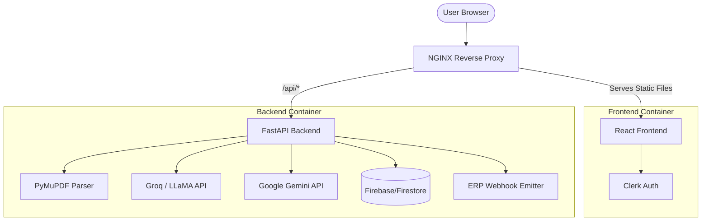

<div align="center">
  

  # Maji-DevisAI

  **Industrial B2B SaaS Platform for Automated Manufacturing Quotations**

  <p align="center">
    <a href="#-recommended-docker-deployment"></a>
    <a href="#1-backend-setup"></a>
    <a href="#2-frontend-setup"></a>
    <a href="#-testing--ci"></a>
  </p>

  <p>
    <em>Bridging state-of-the-art AI Vision with deterministic industrial mathematics to calculate precise sheet metal fabrication costs in seconds.</em>
  </p>
</div>

---

## Table of Contents
- [Overview](#-overview)
- [Key Features](#-key-features)
- [System Architecture](#-system-architecture)
- [Detailed Documentation](#-detailed-documentation)
  - [Backend Engine](#backend-engine-fastapi)
  - [Frontend Interface](#frontend-interface-react)
  - [ERP & Webhooks](#erp-integration)
- [Getting Started](#-getting-started)
- [API Reference](#-api-reference)
- [Testing & CI/CD](#-testing--cicd)

---

## Overview

**Maji-DevisAI** is an advanced, enterprise-grade B2B platform designed to automate the quotation process for manufacturing companies (focusing on sheet metal fabrication, laser cutting, bending, and surface treatments).

By leveraging a dual-engine approach—**AI Vision** for rapid parameter extraction from 2D blueprints and a **Deterministic Cost Engine** for financial precision—Maji AI eliminates the bottlenecks of manual quoting while guaranteeing strictly coherent numerical outputs.

---

## Key Features

| Feature | Description |
| :--- | :--- |
| **AI-Powered Extraction** | Utilizes **Google Gemini Vision** and **Groq (LLaMA 3.3)** to read blueprints and extract specs (material, dimensions, hole counts, bend radii) instantly. |
| **Deterministic Engine** | Calculates exact geometric mass, cutting times, bending setups, and labor overhead using industry-standard, configurable formulas. |
| **Anomaly Detection** | Built-in AI guardrails cross-reference extracted vs. calculated masses, flagging missing data or geometric anomalies before validation. |
| **Global Configuration** | Dedicated Admin Panel for technical directors to globally update machine rates, material costs, and margin templates in real-time. |
| **ERP Synchronization** | One-click webhook integrations to push validated quotes directly to industrial ERPs (e.g., Clipper, Sylob, SAP). |
| **Enterprise Auth** | Secured by **Clerk** (JWT & JWKS caching) for robust identity and session management. |

---

## System Architecture

Maji-DevisAI is built on a decoupled, containerized architecture ensuring high scalability, modularity, and rapid developer velocity.



---

## Detailed Documentation

### Backend Engine (FastAPI)
The backend operates as the brain of the application. It is highly modular:
- **`ai_service.py`**: Handles PDF parsing via PyMuPDF. It uses a tiered extraction strategy—trying Gemini Vision first, OpenRouter as a fallback, and Groq for complex text structuring. It features robust Regex-based JSON parsing and token truncation to prevent overflow on massive documents.
- **`cost_service.py`**: The deterministic heart. It computes exact material volumes, laser cutting perimeters, and labor times based on the **Global Configuration** fetched from the database. No LLM hallucinations are allowed in financial calculations.
- **`validation_service.py`**: Acts as an automated QA engineer. It compares the AI's extracted weight against the geometric calculated weight. If the deviation exceeds a defined threshold (e.g., >20%), it flags the quote for human review.

### Frontend Interface (React)
- **Clean & Pro UI**: The interface strictly adheres to B2B SaaS standards. It uses sharp corners, solid distinct colors, subtle shadows, and a highly utilitarian layout to maximize operator efficiency.
- **State Management**: The wizard flow is orchestrated via `AppContext.jsx`, with API logic cleanly abstracted into `services/api.js`.
- **Global Settings Panel**: Administrators can navigate to the Settings tab to update material prices and machine rates globally, synchronizing the entire company.

### ERP Integration
Maji-DevisAI provides a webhook system (`POST /api/webhook/erp`). Validated quotes can be bulk-synced directly to an external ERP system, converting the standardized JSON schema into the required format for immediate production scheduling.

---

## Getting Started

### Prerequisites
- Docker and Docker Compose (Recommended)
- Node.js 18+ (For local frontend)
- Python 3.10+ (For local backend)
- API Keys: Clerk, Groq, Google Gemini

### Recommended: Docker Deployment

1. **Clone & Configure**:
   ```bash
   cp backend/.env.example backend/.env
   # Edit backend/.env and insert your API keys (GROQ_API_KEY, GEMINI_API_KEY)
   ```

2. **Build and Start**:
   ```bash
   docker compose up -d --build
   ```

3. **Access**:
   - Web UI: `http://localhost:80`
   - Backend Docs: `http://localhost:8000/docs`

### Local Development

<details>
<summary><strong>1. Backend Setup</strong></summary>

```bash
cd backend
python -m venv venv
source venv/bin/activate  # Windows: venv\Scripts\activate
pip install -r requirements.txt

# Start the server with hot-reload
uvicorn main:app --reload --port 8000
```
</details>

<details>
<summary><strong>2. Frontend Setup</strong></summary>

```bash
cd app
npm install

# Format code (Prettier)
npm run format

# Start the development server
npm run dev
```
Available at `http://localhost:5173`.
</details>

---

## API Reference

The backend exposes a fully documented OpenAPI specification at `/docs` (or `/redoc`). Key endpoints include:

- `POST /api/extract`: Uploads a PDF/Image and returns a standardized JSON spec sheet.
- `POST /api/calculate`: Submits specs + config to receive a deterministic cost breakdown.
- `POST /api/validate`: Cross-references specs and costs for physical anomalies.
- `GET/POST /api/config`: Retrieves or updates the global company configuration (Admin).
- `POST /api/webhook/erp`: Triggers synchronization with an external ERP system.

---

## Testing & CI/CD

Maji-DevisAI enforces strict quality control through **GitHub Actions** (`.github/workflows/ci.yml`).

Every push or pull request automatically triggers:
1. **Backend Tests**: `pytest` validates the AI extraction integrity, schema fallbacks, and the math engine's determinism.
2. **Frontend Linting**: `eslint` and `prettier --check` ensure the UI codebase remains spotless and standard-compliant.

To run tests locally:
```bash
# Backend
cd backend && pytest tests/ -v

# Frontend
cd app && npm run lint && npm run format
```

---
<div align="center">
  <em>Developed for industrial performance and engineering precision.</em>
</div>
