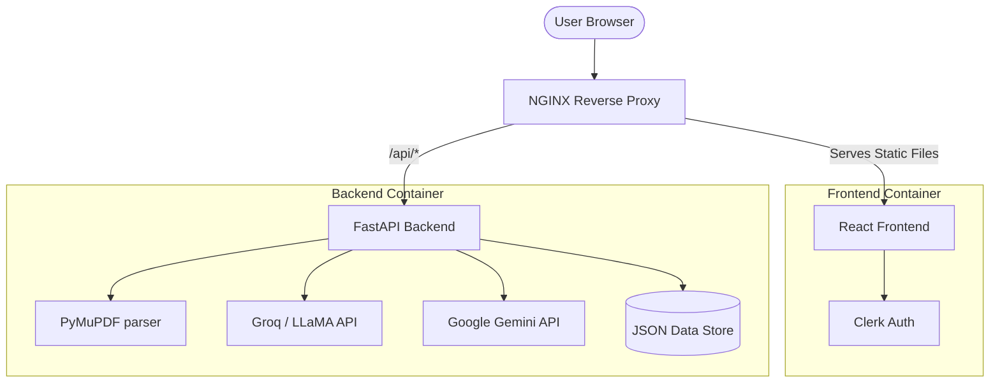

<div align="center">
  

  # Maji-DevisAI

  **Industrial B2B SaaS Platform for Automated Manufacturing Quotations**

  [](#-recommended-docker-deployment)
  [](#1-backend-setup)
  [](#2-frontend-setup)
  [](#-testing)
</div>

## Overview

Maji-DevisAI is an advanced, industrial-grade B2B SaaS platform specifically designed to automate and streamline the quotation (devis) process for manufacturing companies, with a strong focus on sheet metal fabrication, laser cutting, and bending.

By combining a sleek, professional frontend with a deterministic calculation engine and state-of-the-art AI Vision capabilities, MAJI AI can seamlessly extract technical specifications from complex PDF blueprints and generate highly accurate manufacturing costs in seconds.

## Key Features

- **AI-Powered Extraction**: Utilizes Google Gemini Vision and Groq (LLaMA 3.3) to read and extract technical parameters (material, dimensions, hole counts, bend radii) directly from 2D blueprints.
- **Deterministic Cost Engine**: Calculates geometric mass, laser cutting times, bending setup, surface treatment, and labor overhead using industry-standard formulas to guarantee numerical consistency.
- **AI Consistency Control**: Built-in guardrails cross-reference AI-extracted mass against geometric calculated mass to flag hallucinations or missing data before validation.
- **Dual-View PDF Generation**: Dynamically generates precise commercial quotes (for clients) and detailed technical production sheets (for the workshop).
- **Authentication**: Integrated with Clerk for robust, enterprise-ready identity and session management.

## Architecture

Maji-DevisAI is built on a decoupled, containerized architecture ensuring high scalability and developer velocity.



### Technology Stack
- **Frontend**: React 18, Vite, Custom CSS (Glassmorphism & Modern UI), html2pdf.js, Lucide Icons, Clerk.
- **Backend**: Python 3.10+, FastAPI, PyMuPDF, Pytest.
- **AI Models**: LLaMA-3.3-70b-versatile (via Groq), Gemini-2.5-Flash (via Google API).
- **Infrastructure**: Docker, Docker Compose, NGINX, GitHub Actions.

---

## Getting Started

### Prerequisites
- Docker and Docker Compose (Recommended)
- Node.js 18+ (For local frontend development)
- Python 3.10+ (For local backend development)

### Recommended: Docker Deployment

The fastest way to run the entire application (Frontend + Backend + Proxy) is via Docker Compose.

1. **Clone the repository** and configure environment variables:
   ```bash
   cp backend/.env.example backend/.env
   # Edit backend/.env and insert your API keys (GROQ_API_KEY, GEMINI_API_KEY)
   ```

2. **Build and start the containers**:
   ```bash
   docker compose up -d --build
   ```

3. **Access the application**:
   - Web UI: `http://localhost:80`
   - Backend Swagger Docs: `http://localhost:80/api/docs`

---

## Local Development Guide

If you prefer to run the services outside of Docker for development purposes:

### 1. Backend Setup

The backend is built with FastAPI and runs on port 8000.

```bash
cd backend
python -m venv venv
source venv/bin/activate  # Windows: venv\Scripts\activate
pip install -r requirements.txt

# Start the server with hot-reload
uvicorn main:app --reload --port 8000
```

### 2. Frontend Setup

The frontend is a Vite + React application.

```bash
cd app
npm install

# Start the development server
npm run dev
```
The application will be available at `http://localhost:5173`.

---

## Testing

The backend calculation and AI extraction schemas are strictly monitored through unit tests. We enforce deterministic math over AI estimations.

```bash
cd backend
pytest tests/ -v
```

The test suite covers:
- AI Extraction integrity (JSON parsing, fallback mechanisms).
- Cost Service determinism (Geometric mass priority over AI hallucinations, VAT calculation).
- Validation Service logic (Tolerance threshold warnings, Missing materials).

---

## Security & Best Practices

- **Strict Environment Separation**: API Keys are isolated in the `.env` file and never exposed to the frontend.
- **Payload Validation**: All endpoints use strict Pydantic models (`models.py`) to prevent injection and ensure data integrity.
- **File Upload Guardrails**: The API rejects files larger than 10MB and validates MIME types before processing.

---
*Developed for industrial quoting performance.*
